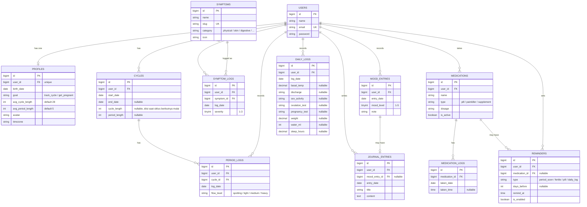

# Database Design — Entity Relationship Diagram

Dokumen ini menjelaskan skema database aplikasi **pelacak menstruasi** (terinspirasi Flo) beserta seluruh relasi Eloquent yang dipakai.

## 1. Fitur

| Fitur | Keterangan | Tabel utama |
|-------|------------|-------------|
| Profil & tujuan | Rata-rata siklus/haid, tanggal lahir, tujuan (lacak siklus / program hamil) | `profiles` |
| Catat periode | Tanggal mulai-selesai haid dan intensitas aliran harian | `cycles`, `period_logs` |
| Gejala | Kram, sakit kepala, jerawat, kembung, dll. dengan tingkat keparahan | `symptoms`, `symptom_logs` |
| Mood | Skala 1–5 per hari | `mood_entries` |
| Catatan harian | Jurnal teks, opsional terhubung ke mood | `journal_entries` |
| Log harian ala Flo | Suhu basal, cairan vagina, aktivitas seksual, tes ovulasi, tes kehamilan, berat badan, air minum, tidur | `daily_logs` |
| Obat & suplemen | Pil KB, pereda nyeri, zat besi + catatan konsumsi | `medications`, `medication_logs` |
| Pengingat | Haid segera datang, masa subur, minum pil, catat harian | `reminders` |
| Prediksi & fase siklus | Haid berikutnya, masa subur, ovulasi, fase siklus | dihitung dari `cycles` |
| Statistik & peringatan | Grafik siklus, gejala tersering, siklus tidak teratur | dihitung dari log |

## 2. Entity Relationship Diagram

## 3. Relationship Summary

| Type | Relationship | Eloquent |
|------|--------------|----------|
| One-to-One | `User` ↔ `Profile` | `hasOne` / `belongsTo` |
| One-to-One (optional) | `MoodEntry` ↔ `JournalEntry` | `hasOne` / `belongsTo` |
| One-to-Many | `User` → `Cycle` | `hasMany` / `belongsTo` |
| One-to-Many | `Cycle` → `PeriodLog` | `hasMany` / `belongsTo` |
| One-to-Many | `User` → `PeriodLog` | `hasMany` / `belongsTo` |
| One-to-Many | `User` → `MoodEntry` | `hasMany` / `belongsTo` |
| One-to-Many | `User` → `JournalEntry` | `hasMany` / `belongsTo` |
| One-to-Many | `User` → `DailyLog` | `hasMany` / `belongsTo` |
| One-to-Many | `User` → `Medication` | `hasMany` / `belongsTo` |
| One-to-Many | `Medication` → `MedicationLog` | `hasMany` / `belongsTo` |
| One-to-Many | `User` → `Reminder` | `hasMany` / `belongsTo` |
| One-to-Many | `Medication` → `Reminder` (opsional) | `hasMany` / `belongsTo` |
| Many-to-Many + pivot data | `User` ↔ `Symptom` (pivot `symptom_logs`, kolom `log_date`, `severity`) | `belongsToMany` + `withPivot` |
| Has-Many-Through | `User` → `PeriodLog` through `Cycle` | `hasManyThrough` |

## 4. Symptoms (seeded)

Tabel `symptoms` diisi seeder dengan gejala bawaan, misalnya: Kram perut, Sakit kepala, Nyeri payudara, Kembung, Jerawat, Nyeri punggung, Mual, Lelah, Craving makanan, Insomnia.

## 5. Design Notes

- **Unique constraints:** `profiles.user_id`, `symptoms.slug`, (`period_logs.user_id`, `period_logs.log_date`), (`mood_entries.user_id`, `mood_entries.entry_date`), (`daily_logs.user_id`, `daily_logs.log_date`), dan (`symptom_logs.user_id`, `symptom_logs.symptom_id`, `symptom_logs.log_date`).
- **Journal ↔ mood:** `journal_entries.mood_entry_id` nullable dan unique, jadi jurnal bisa ada tanpa mood, tetapi satu mood paling banyak punya satu jurnal.
- **Cycle:** `cycle_length` dan `period_length` diisi otomatis saat siklus berikutnya dimulai (selisih `start_date`).
- **Prediksi tidak disimpan:** haid berikutnya = `start_date` terakhir + rata-rata panjang 3–6 siklus terakhir; ovulasi ≈ 14 hari sebelum haid berikutnya; masa subur = 5 hari sebelum sampai 1 hari setelah ovulasi. Fase siklus (menstruasi, folikular, ovulasi, luteal) juga dihitung, bukan disimpan.
- **Peringatan:** siklus < 21 atau > 35 hari ditandai tidak teratur saat statistik dihitung.
- **Cascade rules:** menghapus user menghapus seluruh data miliknya (profil, siklus, log, mood, jurnal, obat, pengingat). Menghapus `medications` menghapus `medication_logs`-nya, sedangkan `reminders.medication_id` di-set null.
